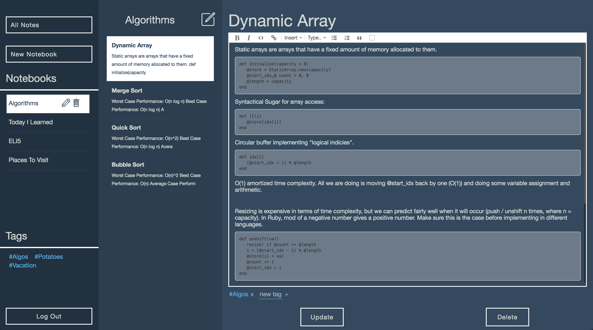
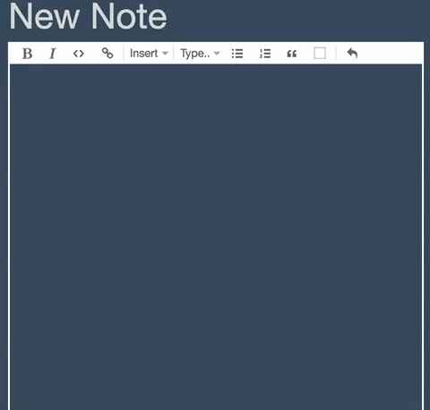
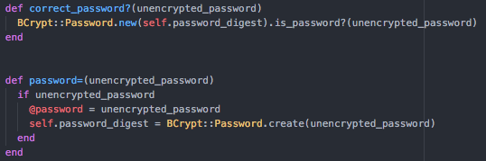

# Codebrew:

[Codebrew](http://www.codebrew.club) is a single-page, organizational web application enabling users to create richly formatted notes, organize notes within notebooks, and tag notes for filtering.

## Core Functionality

* Browse, create, edit, and delete notes stored within notebooks
* Create, edit, or delete notebooks
* Create and update notes within notebooks.
* Tag note(s) based on theme, allowing for subsequent filtering of specifically tagged notes based on tags.
* Rich format area for notes enabling **Bold** and *Italic* words, ordered and unordered lists, code blocks and images.

## Languages, Libraries, Frameworks, and Tools

* Rails
* React.js
* Flux
* Prosemirror
* BCrypt
* JBuilder
* Bootstrap
* Heroku
* Postgres
* Webpack

## Implementation Details

### Flux Architecture

* Applies Facebook's Flux architecture for straightforward management of React components.
* Utilizes 4 stores (Notebooks, Notes, Tags, and User) to support React views.

### React Router

* Employs React Router library for easier component management.
* Router matches paths to mount and unmount components when necessary.

### Prosemirror

* Uses external Prosemirror library for Rich Text formatting and editing.
* Text within note editor is stored as HTML within Postgres Database.
* Utilizes escape characters accordingly to prevent SQL injection.
* Creates a new ProseMirror object within Note Form React component to parse notes to and from HTML format.

### Custom Authentication

* Utilizes BCrypt Gem to hash passwords so no User passwords are stored within DB.

## Design Docs

* [API endpoints][api-endpoints]
* [DB schema][schema]
* [View Wireframes][views]
* [Mock-Ups][mock-ups]

## To Dos

[ ] Incorporate Search Bar for Notes within Notes Index.

[ ] Add modal to notebook creation for more straightforward UX.

[ ] Look into incorporating React Prism || Google Prettify for Code Snippet Syntax highlighting.
